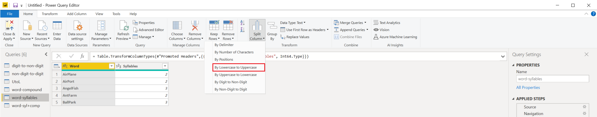
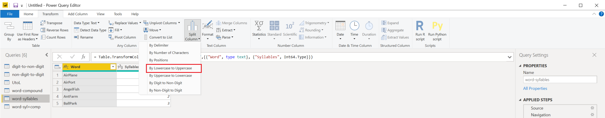
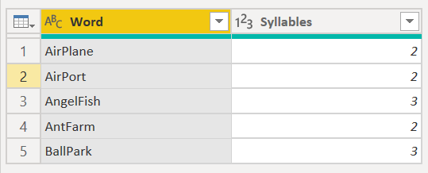
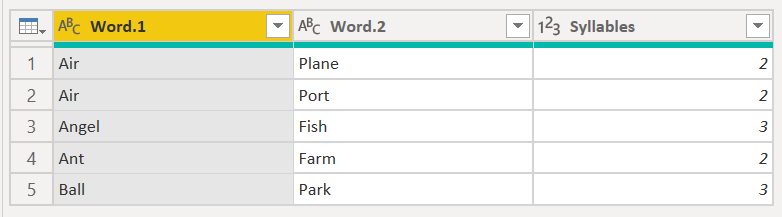

# Split columns by lowercase to uppercase

In Power Query, you can split a column through different methods.
In this case, the column(s) selected can be split by every instance of the last lowercase letter to the next uppercase letter.

## Where to find Split Columns > By Lowercase to Uppercase

You can find the Split Columns: By Lowercase to Uppercase option in three places:

* **Home tab**&mdash;under the **Split Column** dropdown menu inside the **Transform** group.

   

* **Transform tab**&mdash;under the **Split Column** dropdown menu inside the **Text Column** group.

   

* **Right-click a column**&mdash;inside the **Split Column** option.

   

## Split columns by lowercase to uppercase into columns

The initial table in this example will be the one shown in the image below, with one column for **Word** and an extra column named **Syllables**. You'll only focus on the first column.

This column holds two values in each row:

* **FirstWord**&mdash;The first half of the compound word.
* **SecondWord**&mdash;The second half of the compound word.

In this example, you want to split this column into the two columns described in the list above. Select the column and then select the option to split the column by lowercase to uppercase.

This singular column will split into multiple columns given every instance of the last lowercase letter to the next uppercase letter. In this case, it only splits into two columns.

Your final table will look like the following image.

