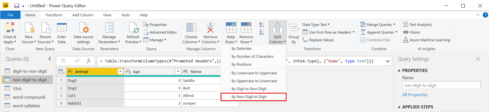

# Split columns by non-digit to digit

In Power Query, you can split a column through different methods.
In this case, the column(s) selected can be split by every instance of a non-digit followed by a digit.

## Where to find Split Columns > By Non-Digit to Digit

You can find the **Split Columns > By Non-Digit to Digit** option in three places:

* **Home tab**&mdash;under the **Split Column** dropdown menu inside the **Transform** group.

   

* **Transform tab**&mdash;under the **Split Column** dropdown menu inside the **Text Column** group.

   

* **Right-click a column**&mdash;inside the **Split Column** option.

   

## Split columns by non-digit to digit into columns 

The initial table in this example will be the one shown in the image below, with a column for **Pets** and other extra columns.
In this example, you'll only focus on the **Pets** column.

This column holds two values in each row:

* **AnimalType**&mdash;The first part is the type of animal. 
* **Number**&mdash;The animal number that came into the person's life.

In this example, you want to split this column into the two columns described in the list above. Select the column and then select the option to split the column by non-digit to digit.

This single column will split into multiple columns, given every instance of a digit followed by a non-digit. In this case, it only splits into two columns.

Your final table will look like the following image.

