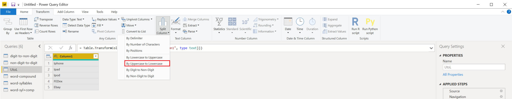
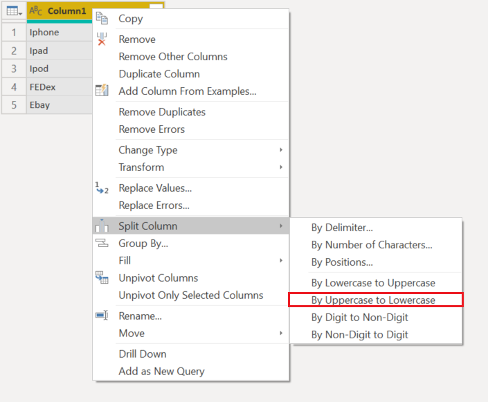
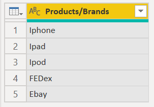

# Split columns by uppercase to lowercase

In Power Query, you can split a column through different methods.
In this case, the column(s) selected can be split by every instance of the last uppercase letter to the next lowercase letter.

## Where to find Split Columns > By Uppercase to Lowercase

You can find the **Split Columns > By Uppercase to Lowercase** option in three places:

* **Home tab**&mdash;under the **Split Column** dropdown menu inside the **Transform** group.

   

* **Transform tab**&mdash;under the **Split Column** dropdown menu inside the **Text Column** group.

   

* **Right-click a column**&mdash;inside the **Split Column** option.

   

## Split columns by uppercase to lowercase into columns

Your initial table in this example will be the one shown in the image below, with only one column for **Column1**.

This column holds two values:

* **FirstWord**&mdash;The first half of a product that is in camel case.
* **SecondWord**&mdash;The second half of a product that is in camel case.

In this example, you want to split this column into the two columns described in the list above. Select the column and then select the option to split the column by uppercase to lowercase.

This single column will split into multiple columns, given every instance of the last uppercase letter to the next lowercase letter. In this case, it only splits into two columns.

Your final table will look like the following image.

