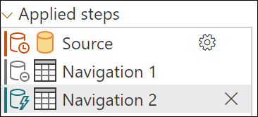
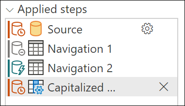
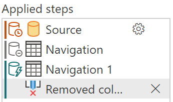
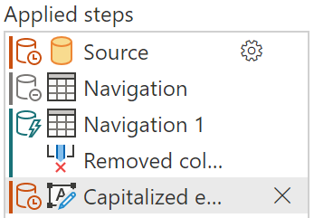
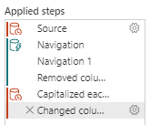

# Step folding indicators

> [!NOTE]
> Before reading this article, we recommended that you read [Query folding in Power Query](query-folding-basics.md) to better understand how folding works in Power Query.

Step folding indicators allow you to understand the steps that fold or not fold. 

Using step folding indicators, when you make a change that breaks folding, it will become obvious. This will allow you to more easily resolve issues quickly, avoid performance issues in the first place, and have better insight into your queries. In most cases you run into, steps will fold, or not fold. There are many cases where the outcome isn't as obvious, discussed in the section on [Step diagnostics indicators](#step-diagnostics-indicators) (Dynamic, Opaque, and Unknown) later in this article.

> [!NOTE]
> The step folding indicators feature is available only for Power Query Online.

## Interpreting step diagnostics

When looking at step diagnostics, the most important thing to understand is that the diagnostic state isn't sequential. In other words, the indicator for that step describes whether the query as a whole, up to that point, folds or not. If you have an indicator that shows that the query doesn't fold, followed by an indicator that shows it does fold, it means that every step up to that point does fold.

You can see an example of this even with a simple query against a SQL source.

Using the [AdventureWorks sample database](https://docs.microsoft.com/sql/samples/adventureworks-install-configure), connect to the Products table and load data. Doing this through the Navigation experience will give the following query:

```
let
  Source = Sql.Database("ServerName", "AdventureWorks"),
  Navigation = Source{[Schema = "Production", Item = "Product"]}[Data]
in
  Navigation
```

If you look at how this shows up in step folding indicators, you can see that the first step doesn't fold, the second step is inconclusive, and the third step folds.



You can see that the initial steps doesn't fold, but the final step generated when you load data initially does fold. How the first steps (**Source**, and sometimes other **Navigation** steps) are handled depends on the connector. With SQL, for example, it's handled as a catalog table value, which doesn't fold. However, as soon as you select data for that connector it will.

Conversely, this can also mean that your query folds up to a point and then stops folding. Unlike in the case where you have a folding indicator for the step, which shows that everything folds, when you have a not folding indicator it doesn't mean that everything doesn't fold - instead it means that "not everything" folds. Generally, everything up to the last folding indicator will fold, with more operations happening after.

Modifying the example from above, you can give a transform that never folds - *Capitalize Each Word*.

```
let
  Source = Sql.Database("ServerName", "AdventureWorks"),
  Navigation = Source{[Schema = "Production", Item = "Product"]}[Data],
  #"Capitalized each word" = Table.TransformColumns(Navigation, {{"Name", each Text.Proper(_), type text}})
in
  #"Capitalized each word"
  ```
  
In step folding indicators, you will see that you have the exact same indicators as above, except the final step doesn't fold. Everything up to this final step will be performed on the data source, while the final step will be performed locally.



## Step diagnostics indicators

Step folding indicators use an underlying query plan, and require it to be able to get information about the query to report it. Currently the query plan only supports tables, so some cases (lists, records, primitives) will not report as folding or not. Similarly, constant tables will report as opaque. 

|Indicator|Icon|Description|
|---------|----|-------|
|**Folding**||The folding indicator tells you that the query up to this step will be evaluated by the data source.|
|**Not folding**||The not folding indicator tells you that some part of the query up to this step will be evaluated outside the data source. You can compare it with the last folding indicator, if there is one, to see if you can rearrange your query to be more performant.|
|**Might fold**||Might fold indicators are uncommon. They mean that a query 'might' fold. They indicate either that folding/not folding will be determined at runtime, when pulling results from the query, and that the query plan is dynamic. These will likely only appear with ODBC or OData connections. |
|**Opaque**||Opaque indicators tell you that the resulting query plan is inconclusive for some reason. It generally indicates that there is a true 'constant' table, or that that transform or connector is not supported by the indicators and query plan tool.|
|**Unknown**||Unknown indicators represent an absence of query plan, either due to an error or attempting to run the query plan evaluation on something other than a table (such as a record, list, or primitive).|

## Example analysis

You can see an example by connecting to the Products table in Adventure Works (SQL). The initial load, similar to above, will look as follows:


Adding more steps that fold will extend that green line. This is because this step also folds.



 Adding a step that doesn't fold will show an indicator, for example, **Capitalize each word** will never fold. You can see that the indicator changes, showing that as of this step, it's stopped folding. As mentioned earlier, the previous steps will still fold.

 

 Adding more steps downstream that depend on **Capitalize each step** will continue to not fold.

 


 However, if you remove the column you applied the capitalization to so that the optimized query plan can all fold once more, you'll get a result like this; although something like this is uncommon. This shows you how it's not just the order of steps, but the actual transformations that apply as well.

 
