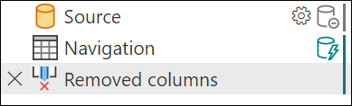

# Query folding indicators

> [!NOTE]
> Before reading this article, we recommended that you read [Overview of query evaluation and query folding in Power Query](query-folding-basics.md) to better understand how folding works in Power Query.

Query folding indicators help you understand the steps that fold or don't fold.

With query folding indicators, it becomes obvious when you make a change that breaks folding. This feature helps you to more easily resolve issues quickly, avoid performance issues in the first place, and have better insight into your queries. In most cases you run into, steps will fold or won't fold. But there are many cases where the outcome isn't as obvious, and these cases are discussed in [Step diagnostics indicators](#step-diagnostics-indicators) (Dynamic, Opaque, and Unknown).

> [!NOTE]
> The query folding indicators feature is available only for Power Query Online.

## Interpreting query folding diagnostics

When you examine the query folding indicator next to a step, the most important thing to understand is that the diagnostic state isn't sequential. In other words, the indicator for that step describes whether the query as a whole, up to that point, folds or not. If you have an indicator that shows that the query doesn't fold, followed by an indicator that shows it does fold, it means that your query up to that point does fold.

This interpretation works even with a simple query against a SQL source. For example, using the [AdventureWorks sample database](/sql/samples/adventureworks-install-configure), connect to the **Production.Product** table and load data. Loading this sample through the Power Query navigator gives the following query:

```powerquery-m
let
  Source = Sql.Database("ServerName", "AdventureWorks"),
  Navigation = Source{[Schema = "Production", Item = "Product"]}[Data]
in
  Navigation
```

If you examine how this code shows up in query folding indicators, you'll note that the first step is inconclusive. But the second step does fold, which means that the query up to that point does fold.


In this example, the initial steps can't be confirmed to fold (is inconclusive), but the final step generated when you load data initially does fold. How the first steps (**Source**, and sometimes other **Navigation** steps) are handled depends on the connector. With SQL, for example, it's handled as a catalog table value, which doesn't fold. However, as soon as you select data for that connector, it will fold.

Conversely, this can also mean that your query folds up to a point and then stops folding. Unlike in the case where you have a folding indicator for the step that shows that everything folds, when you have a not-folding indicator it doesn't mean that everything doesn't fold. Instead, it means that "not everything" folds. Generally, everything up to the last folding indicator will fold, with more operations happening after.

Modifying the example from above, you can give a transform that never folds&mdash;*Capitalize Each Word*.

```powerquery-m
let
  Source = Sql.Database("ServerName", "AdventureWorks"),
  Navigation = Source{[Schema = "Production", Item = "Product"]}[Data],
  #"Capitalized each word" = Table.TransformColumns(Navigation, {{"Name", each Text.Proper(_), type text}})
in
  #"Capitalized each word"
  ```
  
In the query folding indicators, you have the same indicators as above, except the final step doesn't fold. Everything up to this final step will be performed on the data source, while the final step will be performed locally.


## Step diagnostics indicators

Query folding indicators use an underlying query plan, and require it to be able to get information about the query to report it. Currently the query plan only supports tables, so some cases (lists, records, primitives) won't report as folding or not. Similarly, constant tables report as opaque.

|Indicator|Icon|Description|
|---------|----|-------|
|**Folding**||The folding indicator tells you that the query up to this step will be evaluated by the data source.|
|**Not folding**||The not-folding indicator tells you that some part of the query up to this step will be evaluated outside the data source. You can compare it with the last folding indicator, if there is one, to see if you can rearrange your query to be more performant.|
|**Might fold**||Might fold indicators are uncommon. They mean that a query "might" fold. They indicate either that folding or not folding will be determined at runtime, when pulling results from the query, and that the query plan is dynamic. These indicators will likely only appear with ODBC or OData connections. |
|**Opaque**||Opaque indicators tell you that the resulting query plan is inconclusive for some reason. It generally indicates that there's a true "constant" table, or that that transform or connector isn't supported by the indicators and query plan tool.|
|**Unknown**||Unknown indicators represent an absence of a query plan, either due to an error or attempting to run the query plan evaluation on something other than a table (such as a record, list, or primitive).|

## Example analysis

For an example analysis, start by connecting to the **Production.Product** table in Adventure Works (SQL). The initial load, similar to the example above, looks like the following image.


Adding more steps that fold will extend that green line on the right side. This extension occurs because this step also folds.



 Adding a step that doesn't fold displays a different indicator. For example, **Capitalize each word** never folds. The indicator changes, showing that as of this step, it's stopped folding. As mentioned earlier, the previous steps will still fold.

 

 Adding more steps downstream that depend on **Capitalize each step** will continue to not fold.

 

 However, if you remove the column you applied the capitalization to so that the optimized query plan can all fold once more, you'll get a result like the following image. However, something like this is uncommon. This image illustrates how it's not just the order of steps, but the actual transformations that apply as well.

 
