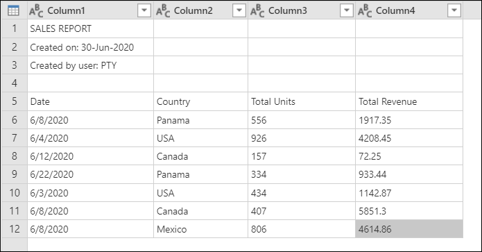
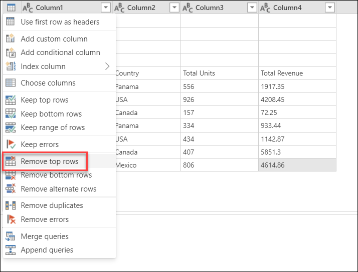
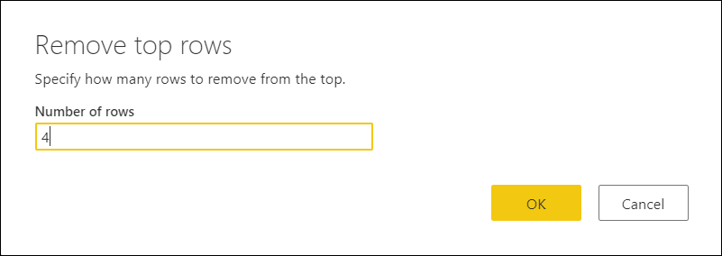
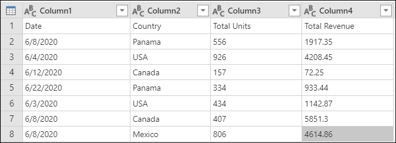
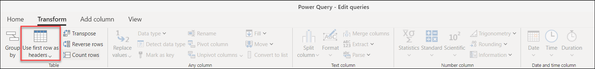
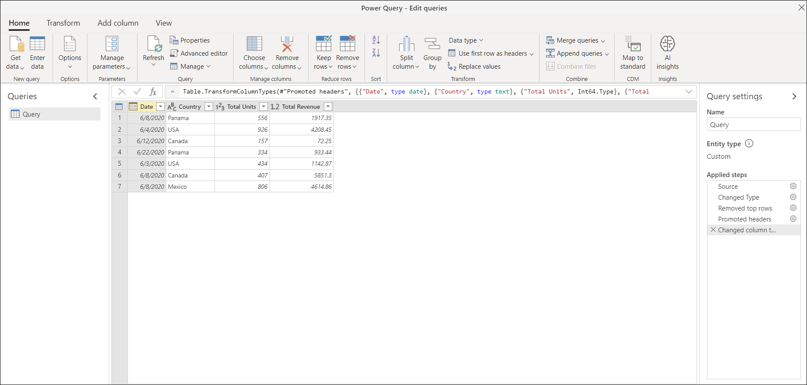
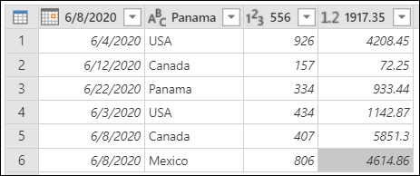
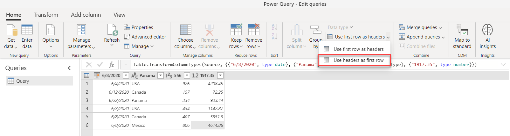
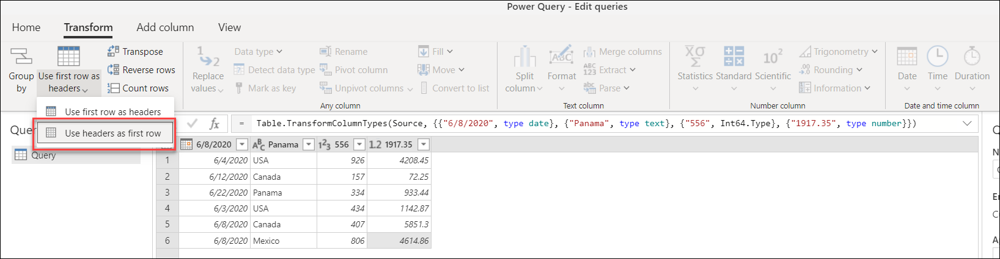
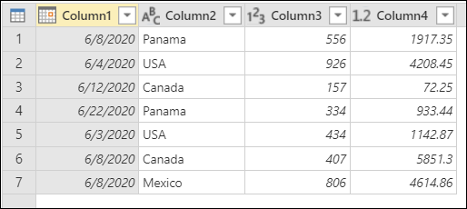

# Promote or demote column headers

When creating a new query from unstructured data sources such as text files, Power Query will analyze the contents of the file. If Power Query identifies a different pattern for the first row, it will try to promote the first row of data as the column headers for your table. However, Power Query might not identify the pattern correctly 100% of the time, so this article explains how you can manually promote or demote column headers from rows. 

With Power Query, there are transformations to promote the rows to column headers as well as demote the column headers to rows.

## To promote rows to column headers

In this example, Power Query wasn't able to determine the headers of the table because the table contains a set of heading rows for the first three rows. The actual headers of the table begin on row 5.

Before you can promote the headers, you need to remove the first four rows of the table. To make that happen, use the contextual table menu on the top-left corner of the preview window and select the option to **Remove top rows**.

The **Remove top rows** window will appear. In this window, enter the number **4** to the number of rows that you want to remove from the top.

> [!Note] 
> To learn more about **Remove top rows** and other table operations, see [Filter by row position](filter-row-position.md).

The result of that operation will leave your headers as the first row of your table.

### Locations of the promote headers operation

From here, you have a number of places where you can select the promote headers operation:

* **Home tab**&mdash;inside the **Transform** group.

   

* **Transform tab**&mdash;inside the **Table** group.

   

* **Contextual table menu**&mdash;the first option from the dropdown menu.

   

After you do the promote headers operation, your table will look like the following image.

>[!Note]
> Table column names must be unique. If the rows to be promoted to headers contain multiple instances of the same text string, Power Query will disambiguate the column names by adding a numeric suffix preceded by a dot to every text string instance that is not unique.

## To demote column headers to rows

In the following example, the table headers are incorrect and are, in fact, part of the table's data. You need to demote the headers to be part of the rows of the table.

### Locations of the demote headers operation

* **Home tab**&mdash;as an option from the drop-down menu of **Use first row as headers** in the **Transform** group.

   

* **Transform tab**&mdash;as an option from the drop-down menu of **Use first row as headers** in the **Table** group.

   

After you do this operation, your table will look like the one in the following image.

As a last step, rename the columns by double-clicking on each column and typing a new name for each of the columns. The end result will look like the following image.

