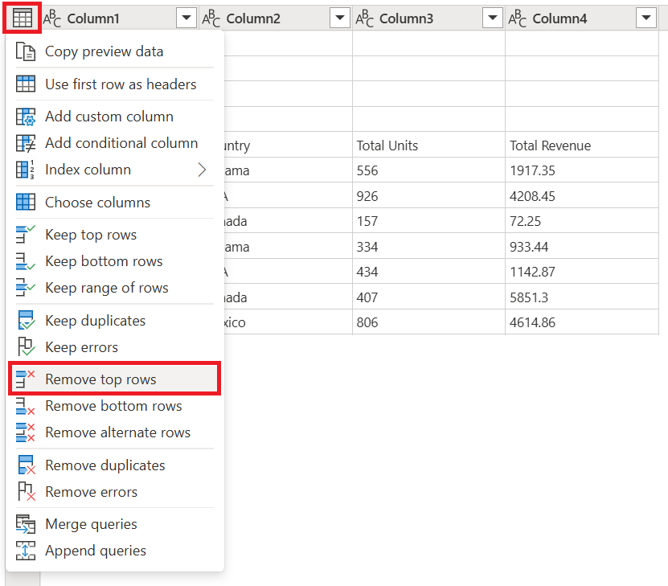
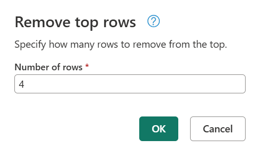
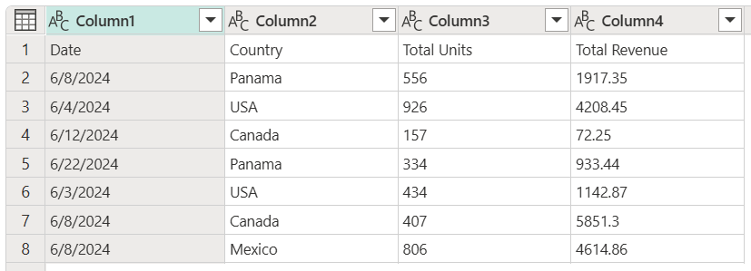
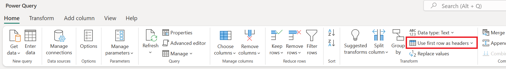
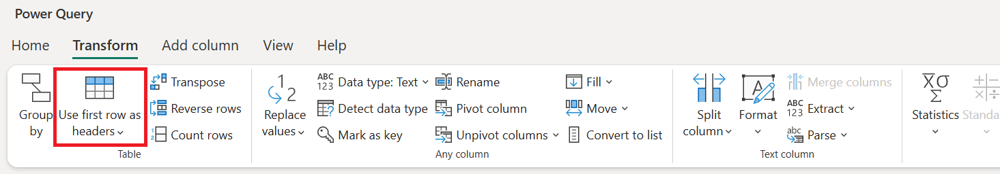
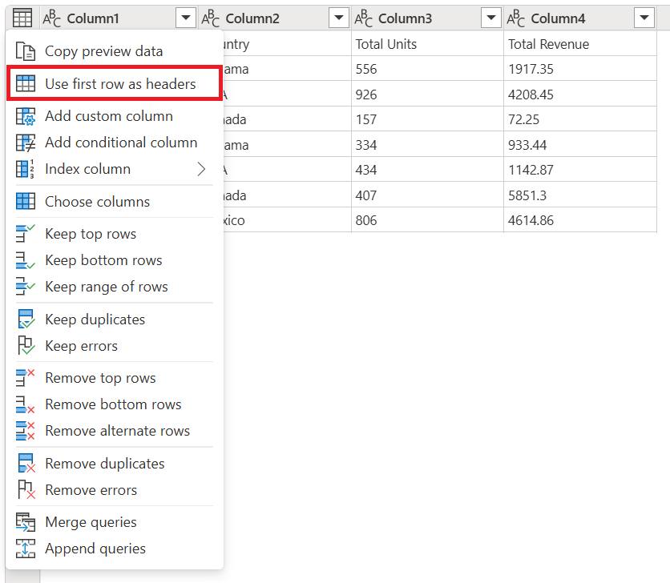
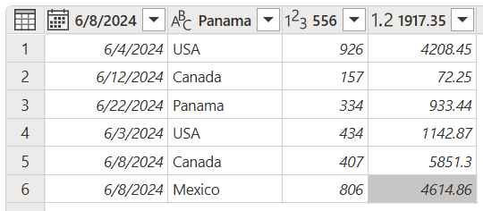
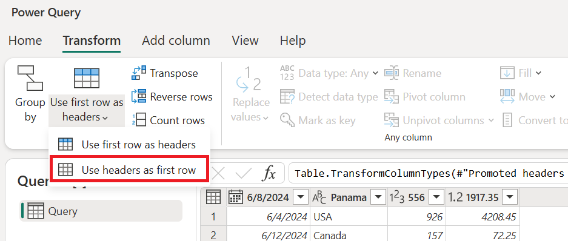
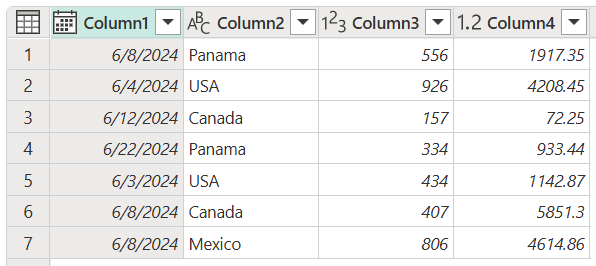

# Promote or demote column headers

When creating a new query from unstructured data sources such as text files, Power Query analyzes the contents of the file. If Power Query identifies a different pattern for the first row, it will try to promote the first row of data to be the column headings for your table. However, Power Query might not identify the pattern correctly 100&nbsp;percent of the time, so this article explains how you can manually promote or demote column headers from rows.

## To promote rows to column headers

In the following example, Power Query wasn't able to determine the column headers for the table because the table contains a set of header rows for the first three rows. The actual column headers for the table are contained in row 5.

:::image type="complex" source="media/table-promote-demote-headers/promote-sample-table.png" alt-text="Initial sample table for promote rows to column headers.":::
   Table with the columns (Column1, Column2, Column3 and column 4) all set to the Text data type, with four rows containing a header at the top, a column header in row 5, and seven data rows at the bottom.
:::image-end:::

Before you can promote the headers, you need to remove the first four rows of the table. To make that happen, select the table menu in the upper-left corner of the preview window, and then select **Remove top rows**.

In the **Remove top rows** window, enter **4** in the **Number of rows** box.

> [!NOTE]
> To learn more about **Remove top rows** and other table operations, go to [Filter by row position](filter-row-position.md).

The result of that operation will leave the headers as the first row of your table.

### Locations of the promote headers operation

From here, you have a number of places where you can select the promote headers operation:

* On the **Home** tab, in the **Transform** group.

   

* On the **Transform** tab, in the **Table** group.

   

* On the table menu.

   

After you do the promote headers operation, your table will look like the following image.

:::image type="complex" source="media/table-promote-demote-headers/promote-final-table.png" alt-text="Final table with the promote headers operation.":::
   Table with Date, Country, Total Units, and Total Revenue column headers, and seven rows of data. The Date column header has a Date data type, the Country column header has a Text data type, the Total Units column header has a Whole number data type, and the Total Revenue column header has a Decimal number data type.
:::image-end:::

>[!NOTE]
> Table column names must be unique. If the row you want to promote to a header row contains multiple instances of the same text string, Power Query will disambiguate the column headings by adding a numeric suffix preceded by a dot to every text string that isn't unique.

## To demote column headers to rows

In the following example, the column headers are incorrect: they're actually part of the table's data. You need to demote the headers to be part of the rows of the table.

### Locations of the demote headers operation

You have a number of places where you can select the demote headers operation:

* On the **Home** tab, in the **Transform** group.

   

* On the **Transform** tab, in the **Table** group.

   

After you do this operation, your table will look like the following image.

As a last step, select each column and type a new name for it. The end result will resemble the following image.

:::image type="complex" source="media/table-promote-demote-headers/demote-final-table.png" alt-text="Final table after renaming column headers.":::
   Final table after renaming column headers to Date, Country, Total Units, and Total Revenue, with Renamed columns emphasized in the Query settings pane and the M code shown in the formula bar.
:::image-end:::

### See also

[Filter by row position](filter-row-position.md)
