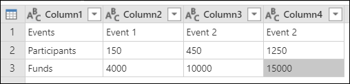
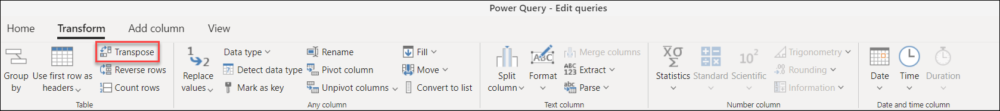
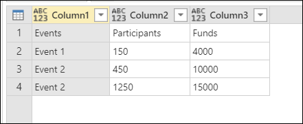
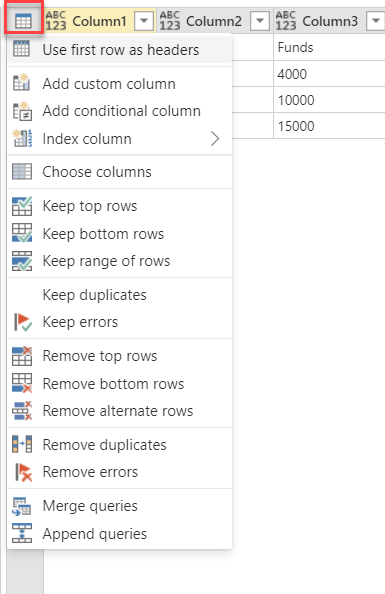

# Transpose table

The transpose table operation in Power Query rotates your table 90 degrees by making your rows become columns and your columns become rows.

## To transpose a table

Imagine a table like the one in the following image, with three rows and four columns.

The goal of this example is to transpose that table so you end up with four rows and three columns.

First, go to the **Transform** tab in the ribbon and select **Transpose** inside the **Table** group.

The result of that operation will look like the following image.

> [!Note]
> When doing the transpose operation, the column headers of the initial table will be lost. Only the contents of the table will be transposed during the operation. The new columns will have the name of **Column** followed by a sequential number.

## Post transpose cleaning

The headers that you need in this example are in the first row of the table. Your final table will look like the following image. To promote the first row to headers, select the table contextual icon inside the **Data Preview** section. Then select the option to **Use first row as headers**.

The result of that operation will give you the output that you're looking for.

