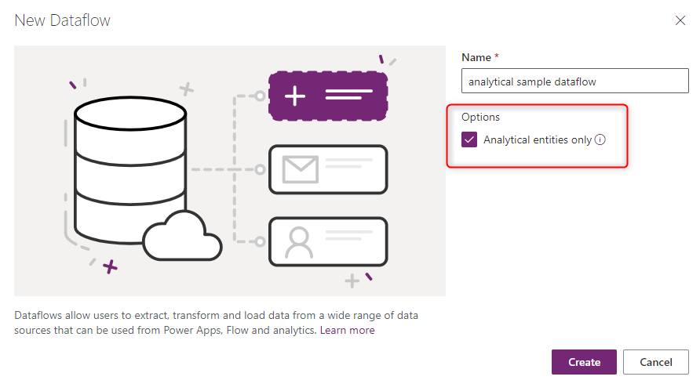

# Understanding the differences between Analytical and Standard Dataflows

Dataflows are categorized in many ways, and one of those ways is the split in Analytical vs Standard Dataflows. Understanding this concept helps you to create the dataflow for the right requirement. Dataflows create entities, and entities are in two types: Analytical Entity, and Standard Entity. Based on the type of entity produced by the dataflow, we call the dataflow; analytical or standard.

## Standard Dataflow

A dataflow by the standard definition is a service to extract, transform, and load the data into a destination. The standard dataflow supports Power Query transformations, and it can get data from any sources that Power Query is compatible with. The entities of this type of dataflow stores their data into Common Data Services (CDS). So it is called Standard Dataflow.

Standard dataflows can be created by Power Platform Dataflows when created through the Power Apps portal. 

One benefit of this type of dataflow is that any application that can connect to CDS (Common Data Services), can work with the data. Which means; Power BI, Power Apps, Power Automate, Power Virtual Agent, and Dynamics, and some other applications.

## Analytical Dataflow

An analytical dataflow, in addition to doing the transformation, is also capable of extra analytical features, which can be AI functions in the dataflow, and also the usage of Computed Entity. Analytical entities in the analytical dataflow stores their data in Azure Data Lake storage.

Analytical Dataflow can be created using Power BI dataflows. Regardless if it is an external dataflow (dataflow connected to customer's Azure Data Lake Storage Gen 2), or normal dataflow created in Power BI.

Analytical Dataflow can be also created in Power Platform dataflows. The selection of analytical dataflow is an option at the start of creation of the dataflow in the Power Apps portal.

### AI Functionalities

Depends on the requirement, sometimes, you might need to apply some AI and Machine Learning functions on the data through the dataflow. These functionalities are possible when the dataflow is an analytical dataflow. 

Here are some articles about how to use AI functions in a dataflow:

- [Azure Machine Learning integration in Power BI](https://docs.microsoft.com/en-us/power-bi/service-machine-learning-integration)
- [Cognitive Services in Power BI](https://docs.microsoft.com/en-us/power-bi/service-cognitive-services)
- [Automated Machine Learning in Power BI](https://docs.microsoft.com/en-us/power-bi/service-machine-learning-automated)

Functions above are not available in the standard dataflow.

### Computed Entity

One of the reasons to use computed entity is the ability to process large amount of the data. The Computed entity is to help in those scenarios. A computed entity, is an entity that is processed already through the dataflow, and then the result of that can be used in another entity in the same dataflow. 

The computed entity helps with the performance of the data transformations, because instead of re-doing the transformations needed in the first entity over and over again, the transformation will be done only once in the computed entity, and then the result will be used multiple times in other entities.

To learn more about Computed Entity, read this article:

[Using computed entities on Power BI Premium](https://docs.microsoft.com/en-us/power-bi/service-dataflows-computed-entities-premium)

Computed Entity is available only in analytical dataflow.

## Analytical vs. Standard Dataflows

Here are some differences between analytics entity vs standard entity;

|                                   | Analytical                                                   | Standard                                                     |
| --------------------------------- | ------------------------------------------------------------ | ------------------------------------------------------------ |
| How to create                     | Power BI dataflows Power Platform dataflows with checking the Analytical Entity checkbox at the time of creating the dataflow | Power Platform dataflows                                     |
| Storage Options                   | Azure Data Lake Storage Gen 2 internal for the Power BI dataflows Azure Data Lake Storage Gen 2 external attached to the Power BI or Power Platform dataflows | CDS (Common Data Services)                                   |
| Power Query transformations       | Yes                                                          | Yes                                                          |
| AI functions                      | Yes                                                          | No                                                           |
| Computed Entity                   | Yes                                                          | No                                                           |
| Can be used in Other applications | Power BI Dataflows: Only in Power BI Power Platform Dataflows or Power BI External Dataflows: Yes, through Azure Data Lake Storage Gen 2 | Yes, through CDS                                             |
| Mapping to standard Entity        | Yes                                                          | Yes                                                          |
| Incremental Load                  | Default full-load.  Possible to set up incremental refresh with setting up the incremental refresh in the dataflow settings. | Default incremental-load. Possible to change using the "Delete rows that no longer exist in the query output" checkbox at the load settings |
| Scheduled Refresh                 | Yes. Possibility of notifying the dataflow owners upon the failure | Yes.                                                         |

# Scenarios to Use Each Dataflow Type

Here are some sample scenarios and best practice recommendation of usage of each type of the dataflow.

## Heavy Data Transformations on Large Data Tables: Analytical Dataflow

Analytical dataflows are great option for processing large amount of the data, and also enhancing the compute power behind the transformation using the Computed Entity. The fact that the data is stored in Azure Data Lake also increases the speed of writing to destination, because compared to CDS (which might have many rules to check at the time of data storage), Azure Data Lake is faster for read/write transactions in a large amount of data.

## AI Features: Analytical Dataflow

If you are planning to use any of the AI functionalities through the data transformation stage, then analytical dataflow is definitely helpful, because you can use all the AI features supported with this type of dataflow.

## Cross Platform Usage: Standard Dataflow

If your plan when building dataflows is to use the stored data in multiple platforms (not only Power BI, but also other Power Platform services, Dynamics, and etc.) then Standard dataflow is a great choice. Standard dataflow stores the data into CDS, which then can be accessed through many other platforms and services.

