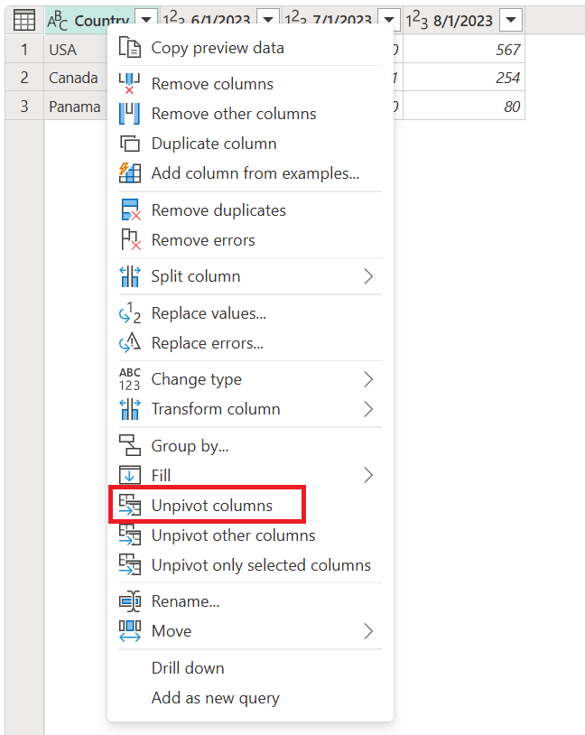
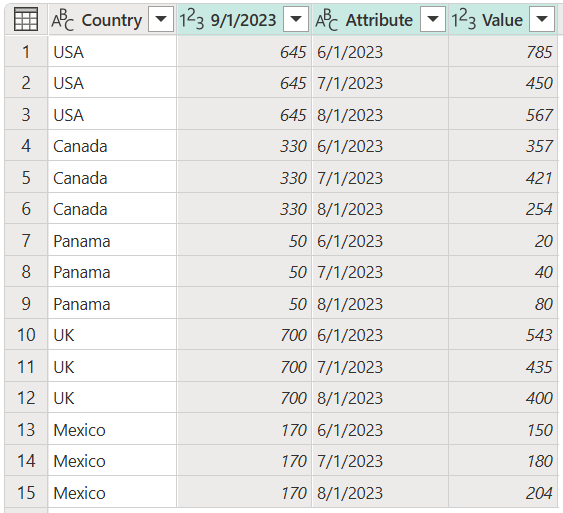

# Unpivot columns

In Power Query, you can transform columns into attribute-value pairs, where columns become rows.

:::image type="complex" source="media/unpivot-column/unpivot-operation-diagram.png" alt-text="Unpivot columns diagram.":::
   Diagram showing a table on the left with a blank column and rows, and the Attributes values A1, A2, and A3 as column headers. The A1 column contains the values V1, V4, and V7, the A2 column contains the values V2, V5, and V8, and the A3 column contains the values V3, V6, and V9. With the columns unpivoted, a table on the right of the diagram contains a blank column and rows, an Attributes column with nine rows with A1, A2, and A3 repeated three times, and a Values column with values V1 through V9.  
:::image-end:::

For example, given a table like the following, where country rows and date columns create a matrix of values, it's difficult to analyze the data in a scalable way.

:::image type="complex" source="media/unpivot-column/unpivot-initial-table.png" alt-text="Unpivot columns sample initial table.":::
   Table containing a Country column set in the Text data type, and 6/1/2020, 7/1/2020, and 8/1/2020 columns set as the Whole number data type. The Country column contains USA in row 1, Canada in row 2, and Panama in row 3.
:::image-end:::

Instead, you can transform the table into a table with unpivoted columns, as shown in the following image. In the transformed table, it's easier to use the date as an attribute to filter on.

:::image type="complex" source="media/unpivot-column/unpivot-final-table.png" alt-text="Unpivot columns sample goal table.":::
   Table containing a Country column set as the Text data type, an Attribute column set as the Text data type, and a Value column set as the Whole number data type. The Country column contains USA in the first three rows, Canada in the next three rows, and Panama in the last three rows. The Attribute column contains 6/1/2020 in the first, forth, and seventh rows, 7/1/2020 in the second, fifth, and eighth rows, and 8/1/2020 in the third, sixth, and ninth rows.
:::image-end:::

The key in this transformation is that you have a set of dates in the table that should all be part of a single column. The respective value for each date and country should be in a different column, effectively creating an attribute-value pair.

Power Query will always create the attribute-value pair by using two columns:

- **Attribute**: The name of the column headings that were unpivoted.
- **Value**: The values that were underneath each of the unpivoted column headings.

There are multiple places in the user interface where you can find **Unpivot columns**. You can right-click the columns that you want to unpivot, or you can select the command from the **Transform** tab in the ribbon.

There are three ways that you can unpivot columns from a table:

- **Unpivot columns**
- **Unpivot other columns**
- **Unpivot only selected columns**

## Unpivot columns

For the scenario described above, you first need to select the columns you want to unpivot. You can select **Ctrl** as you select as many columns as you need. For this scenario, you want to select all the columns except the one named **Country**. After selecting the columns, right-click any of the selected columns, and then select **Unpivot columns**.

The result of that operation will yield the result shown in the following image.

:::image type="complex" source="media/unpivot-column/unpivot-columns-final-table.png" alt-text="Unpivot columns final table.":::
   Table containing a Country column set as the Text data type, an Attribute column set as the Text data type, and a Value column set as the Whole number data type. The Country column contains USA in the first three rows, Canada in the next three rows, and Panama in the last three rows. The Attribute column contains 6/1/2020 in the first, forth, and seventh rows, 7/1/2020 in the second, fifth, and eighth rows, and 8/1/2020 in the third, sixth, and ninth rows. In addition, the Unpivot columns entry is emphasized in the Query settings pane and the M language code is shown in the formula bar.
:::image-end:::

### Special considerations

After creating your query from the steps above, imagine that your initial table gets updated to look like the following screenshot.

:::image type="complex" source="media/unpivot-column/unpivot-updated-source-table.png" alt-text="Unpivot columns updated source table.":::
   Table with the same original Country, 6/1/2020, 7/1/2020, and 8/1/2020 columns, with the addition of a 9/1/2020 column. The Country column still contains the USA, Canada, and Panama values, but also has UK added to the fourth row and Mexico added to the fifth row.
:::image-end:::

Notice that you've added a new column for the date 9/1/2020 (September 1, 2020), and two new rows for the countries/regions UK and Mexico.

If you refresh your query, you'll notice that the operation will be done on the updated column, but won't affect the column that wasn't originally selected (**Country**, in this example). This means that any new column that's added to the source table will be unpivoted as well.

The following image shows what your query will look like after the refresh with the new updated source table.

:::image type="complex" source="media/unpivot-column/unpivot-columns-final-updated-table.png" alt-text="Unpivot columns final updated table.":::
   Table with Country, Attribute, and Value columns. The first four rows of the Country column contains USA, the second four rows contains Canada, the third four rows contains Panama, the fourth four rows contains UK, and the fifth four rows contains Mexico. The Attribute column contains 6/1/2020, 7/1/2020, 8/1/2020, and 9/1/2020 in the first four rows, which are repeated for each country.
:::image-end:::

## Unpivot other columns

You can also select the columns that you don't want to unpivot and unpivot the rest of the columns in the table. This operation is where **Unpivot other columns** comes into play.

The result of that operation will yield exactly the same result as the one you got from **Unpivot columns**.

:::image type="complex" source="media/unpivot-column/unpivot-other-columns-final-table.png" alt-text="Unpivot other columns sample goal table.":::
   Table containing a Country column set as the Text data type, an Attribute column set as the Text data type, and a Value column set as the Whole number data type. The Country column contains USA in the first three rows, Canada in the next three rows, and Panama in the last three rows. The Attribute column contains 6/1/2020 in the first, forth, and seventh rows, 7/1/2020 in the second, fifth, and eighth rows, and 8/1/2020 in the third, sixth, and ninth rows.
:::image-end:::

>[!NOTE]
> This transformation is crucial for queries that have an unknown number of columns. The operation will unpivot all columns from your table except the ones that you've selected. This is an ideal solution if the data source of your scenario got new date columns in a refresh, because those will get picked up and unpivoted.

### Special considerations

Similar to the **Unpivot columns** operation, if your query is refreshed and more data is picked up from the data source, all the columns will be unpivoted except the ones that were previously selected.

To illustrate this, say that you have a new table like the one in the following image.

:::image type="complex" source="media/unpivot-column/unpivot-updated-source-table.png" alt-text="Sample unpivot source table.":::
   Table with Country, 6/1/2020, 7/1/2020, 8/1/2020, and 9/1/2020 columns, with all columns set to the Text data type. The Country column contains, from top to bottom, USA, Canada, Panama, UK, and Mexico.
:::image-end:::

You can select the **Country** column, and then select **Unpivot other column**, which will yield the following result.

:::image type="complex" source="media/unpivot-column/unpivot-other-columns-updated-final-table.png" alt-text="Sample unpivot other columns updated final table.":::
   Table with Country, Attribute, and Value columns. The Country and Attribute columns are set to the Text data type. The Value column is set to the Whole value data type. The first four rows of the Country column contain USA, the second four rows contains Canada, the third four rows contains Panama, the fourth four rows contains UK, and the fifth four rows contains Mexico. The Attribute column contains 6/1/2020, 7/1/2020, 8/1/2020, and 9/1/2020 in the first four rows, which are repeated for each country.
:::image-end:::

## Unpivot only selected columns

The purpose of this last option is to only unpivot specific columns from your table. This is important for scenarios where you're dealing with an unknown number of columns from your data source and you only want to unpivot the selected columns.

To perform this operation, select the columns to unpivot, which in this example is all the columns except the **Country** column. Then right-click any of the columns you selected, and then select **Unpivot only selected columns**.

Notice how this operation will yield the same output as the previous examples.

:::image type="complex" source="media/unpivot-column/unpivot-only-selected-columns-final-table.png" alt-text="Unpivot only selected columns final table.":::
   Table containing a Country column set as the Text data type, an Attribute column set as the Text data type, and a Value column set as the Whole number data type. The Country column contains USA in the first three rows, Canada in the next three rows, and Panama in the last three rows. The Attribute column contains 6/1/2020 in the first, forth, and seventh rows, 7/1/2020 in the second, fifth, and eighth rows, and 8/1/2020 in the third, sixth, and ninth rows.
:::image-end:::

### Special considerations

After doing a refresh, if our source table changes to have a new **9/1/2020** column and new rows for UK and Mexico, the output of the query will be different from the previous examples. Say that our source table, after a refresh, changes to the table in the following image.

The output of our query will look like the following image.

It looks like this because the unpivot operation was applied only on the **6/1/2020**, **7/1/2020**, and **8/1/2020** columns, so the column with the header **9/1/2020** remains unchanged.
