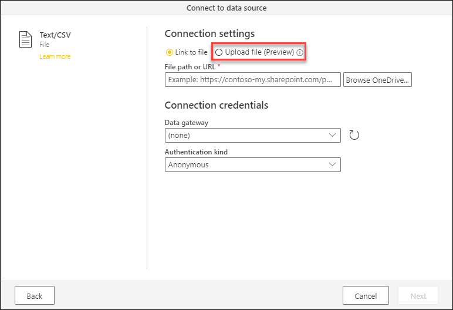
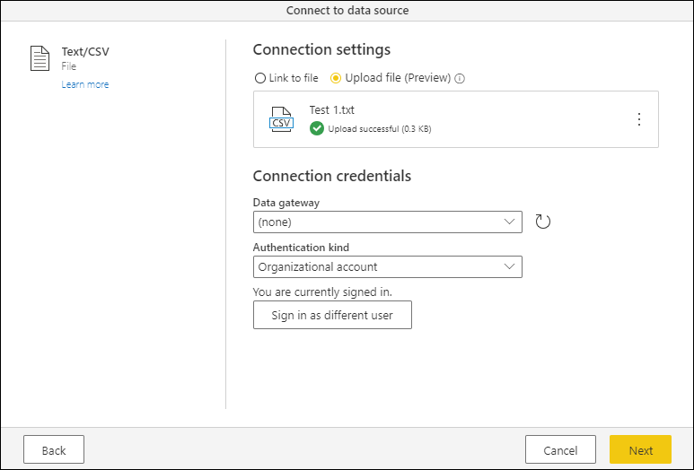
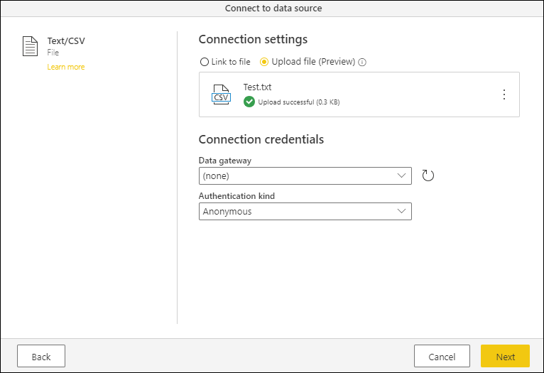

# Upload a file (Preview)

You can upload files to your Power Query project when using the Power Query online experience. 

## Upload a file experience

When you select a connector that offers the *Upload file* experience, you will notice a radio button on the top that enables this experience.

When you select the *Upload file* option, the option underneath will change to showcase a simple dialog to let you either drag a file or browse in your local file system to upload a file.

After you've selected your file, a progress bar will show you how the upload process is going and once the upload process is finished you will be able to see a green check mark underneath your file name and with the message "Upload successful" and the file size right next to it.

>[!NOTE]
>The files that are uploaded through this experience are stored in your personal Microsoft OneDrive for Business account.

Before you hit the next button, you need to change the authentication kind from *Anonymous* to *Organizational account* and go through the authentication process by clicking the *Sign in* button.

After going through the authentication process, you will be able to see a message that reads *You are currently signed in* underneath the **Authentication kind** selected. After this, you are able to click the **Next** button, which will effectively store the file in your personal Microsoft OneDrive for Business account and create a new query from the file that you've uploaded

### Drag and drop experience in the query editor

When using the Power Query editor, you are able to drop a file on either the [Diagram view](diagram-view.md) or the [queries pane](queries-pane.md) to trigger the upload a file experience.

When dropping the file on either of the previously mentioned sections, a dialog with the appropriate connector settings page will be shown based on the file extension of the file that's being uploaded.

## Connectors and file extensions supported

Below is a list of the connectors that provide this experience.

* [Excel](connectors/excel.md)
* [JSON](connectors/json.md)
* [PDF](connectors/pdf.md)
* [Text / CSV](connectors/textcsv.md)
* [XML](connectors/xml.md)

>[!NOTE]
> Only files with the following extensions are supported for upload: .csv, .json, .pdf, .prn, .tsv, .txt, .xl, .xls, .xlsb, .xlsm, .xlsw, .xlsx, .xml.