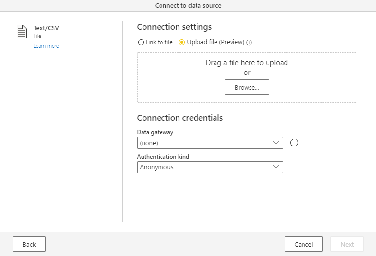
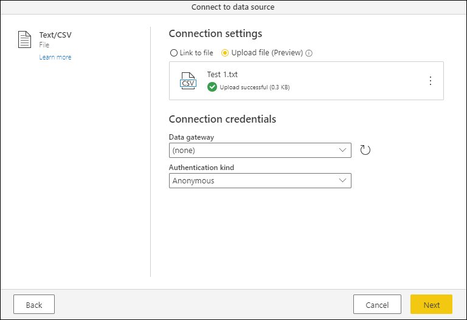
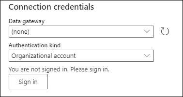
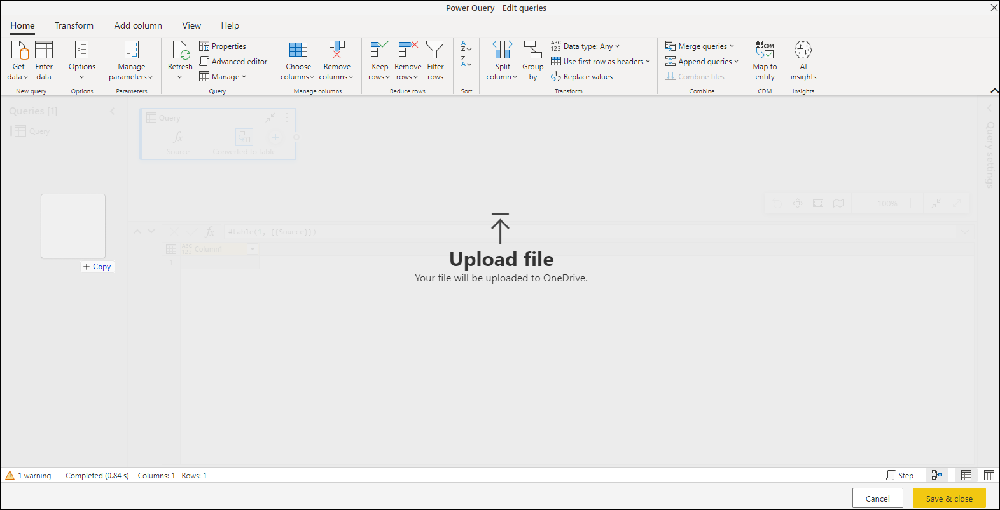

# Upload a file (Preview)

You can upload files to your Power Query project when using Power Query Online.

The following connectors currently support the upload a file feature.

* [Excel](connectors/excel.md)
* [JSON](connectors/json.md)
* [PDF](connectors/pdf.md)
* [Text / CSV](connectors/text-csv.md)
* [XML](connectors/xml.md)

>[!NOTE]
> Only files with the following extensions are supported for upload: .csv, .json, .pdf, .prn, .tsv, .txt, .xl, .xls, .xlsb, .xlsm, .xlsw, .xlsx, .xml.

## Upload a file experience

When you select a connector that offers the *Upload file* experience, you will notice a radio button on the top that enables this feature.

:::image type="content" source="media/upload-file/upload-file-option.png" alt-text="Upload file option in the connection settings section of the connect to a data source dialog.":::

When you select **Upload file**, the option underneath opens a simple dialog to let you either drag a file or browse in your local file system to upload a file.

After you've selected your file, a progress bar shows you how the upload process is going. Once the upload process is finished, you'll be able to see a green check mark underneath your file name, with the message **Upload successful** and the file size right next to it.

>[!NOTE]
>The files that are uploaded through this feature are stored in your personal Microsoft OneDrive for Business account.

Before you select the next button, you need to change the authentication kind from **Anonymous** to **Organizational account** and go through the authentication process. Start this process by selecting **Sign in**.

After going through the authentication process, a **You are currently signed in message** underneath the **Authentication Kind** selection let's you know that you've successfully signed in. After you've signed in, select **Next**. The file is then stored in your personal Microsoft OneDrive for Business account, and a new query is created from the file that you've uploaded.

:::image type="content" source="media/upload-file/connection-credentials-signed-in.png" alt-text="Connect to data source page with a user authenticated using the organizational account authentication kind.":::

### Drag and drop experience in the query editor

When using the Power Query editor, you can drop a file on either the [diagram view](diagram-view.md) or the [queries pane](queries-pane.md) to upload a file.

When dropping the file on either of the previously mentioned sections, a dialog with the appropriate connector settings page will be shown, based on the file extension of the file that's being uploaded.

:::image type="content" source="media/upload-file/drag-drop-txt.png" alt-text="Text / CSV connector settings page shown after dropping a text file on the diagram view of the Power Query editor.":::
