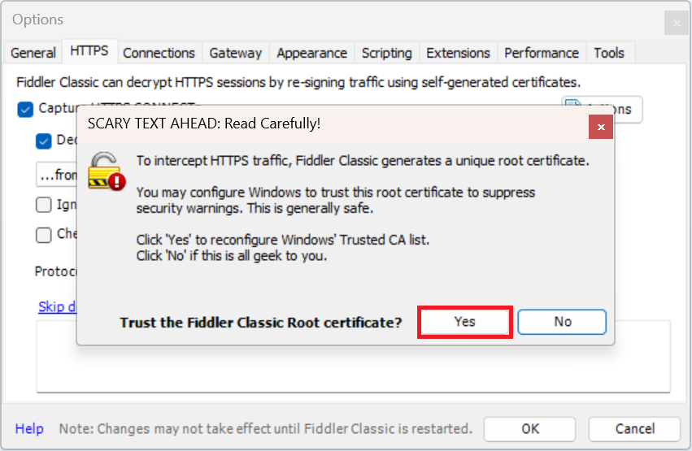

# Capture web requests with Fiddler

When diagnosing issues that may occur when Power Query communicates with your data, you may be asked to supply a Fiddler trace. The information provided by Fiddler can be of significant use when troubleshooting connectivity issues.

>[!Note]
>This article assumes that you are already familiar with how Fiddler works in general.

## Set up Fiddler to capture secure HTTP addresses

Before you can begin capturing web requests issued by Power Query, you must first enable Fiddler to capture secure HTTP addresses (https://) on your device. If you don't already have Fiddler installed, download and install [Fiddler](https://www.telerik.com/download/fiddler/fiddler4) now.

To set up Fiddler to capture secure HTTP addresses:

1. Open Fiddler.

2. Under **File**, clear **Capture Traffic**.

3. Select **Tools** > **Options**.

4. Open the **HTTPS** tab.

5. Select **Capture HTTPS CONNECTs**.

6. Select **Decrypt HTTPS traffic**.

7. In the root certificate dialog box, select **Yes**.

   

8. When asked to confirm that you want to add the certificate to your PCs Trusted Root List, select **Yes**.

9. In the **HTTPS** tab, select **OK**.

10. In the Fiddler traffic pane, select one of the current traces, press **Ctrl + A**, and then press **Delete**. This action clears all of the current traces from the traffic pane.

    

## Guidelines for capturing web requests

Because Fiddler captures all network traffic during the recorded session, be sure to close all other apps and web pages before capturing a fiddler trace. Closing all other apps and web pages clears away most extra web traffic that's not associated with the issue you're trying to capture.

Once you've closed all other apps and web pages not associated with the issue, clear the Fiddler traffic pane as described in step 10 in the previous procedure. Select **File** > **Capture traffic** just before starting the operation in question. Then clear **File** > **Capture traffic** immediately afterward to stop the capture.

These actions minimize the number of messages you have to dig through, and also helps focus the investigation. It also avoids capturing other potentially sensitive information that you don't want to share.

If you're only running Power Query and Fiddler, this minimum setup should yield a sequence of HTTP requests and responses from whatever backend you're communicating with, for example Power BI service, SharePoint, or Azure. The requests, responses, headers, response codes, and sometimes the payload will all provide clues we can use to troubleshoot your issue.

To save the capture session to a log file, select **File** > **Save** > **All Sessions**. You might also be asked to compress the log file (.zip) before sending it.

## See also

- [Query diagnostics](QueryDiagnostics.md)
- [Power Query feedback](feedback.md)
- [Getting started with Fiddler Classic](https://docs.telerik.com/fiddler/configure-fiddler/tasks/configurefiddler)
