# Where to get data

Getting data from available data sources is usually the first encounter you have with Power Query. This article provides basic steps for getting data from each of the products that include Power Query.

## Get data in Power BI Desktop

The procedures for where to start getting data in Power BI Desktop are described in [Data sources in Power BI Desktop](/power-bi/connect-data/desktop-data-sources).

In Power BI Desktop, you can also directly select an Excel worksheet, a Power BI dataset, a SQL server database, or Dataverse data without using the **Get data** option. You can also enter data directly in a table, or select from a data source that was recently used.

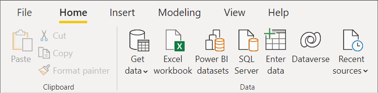

## Get data in Excel (Windows or Mac)

To get data in Excel for Windows or Excel for Mac:

1. From the **Data** ribbon, select **Get Data**.

2. Scroll through the category selections in the get data context menu, and select the connector you want to use.

   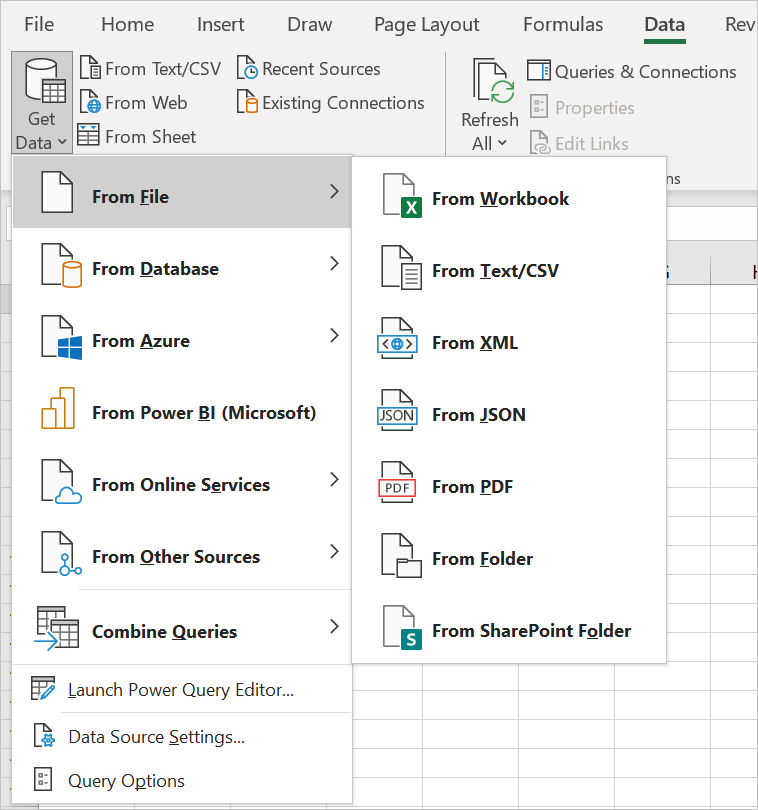

You'll then be asked to fill out information that's required for you to access the data. Go to the [individual connector articles](connectors/index.md) for more information about this required information.

In Excel, you can also directly select Text/CVS, Web, and Excel worksheet data without using the **Get Data** option. You can also select from a data source that was recently used and from existing connections or tables.

>[!Note]
>Not all Excel versions support all of the same Power Query connectors. For a complete list of the Power Query connectors supported by all versions of Excel for Windows and Excel for Mac, go to [Power Query data sources in Excel versions](https://support.microsoft.com/en-us/office/power-query-data-sources-in-excel-versions-e9332067-8e49-46fc-97ff-f2e1bfa0cb16).

## Get data from Power BI service

To get data in Power BI service:

1. On the left side of Power BI service, select **Workspaces** (but not **My Workspace**)

2. From the Workspace context menu, select the workspace you want to use.

3. From the workspace (in this example, TestWorkspace01), select the context menu next to **+New**.

4. From the **New** context menu, select **Dataflow**.

    [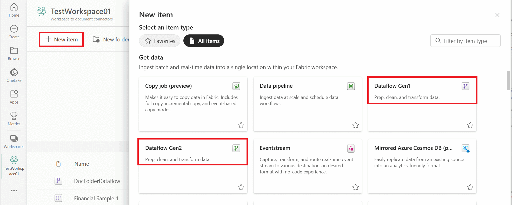](media/where-to-get-data/workspace-dataflow.png#lightbox)

5. From **Define new tables**, select **Add new tables**.

6. Select the connector from the list of data sources.

You'll then be asked to fill out information that's required for you to access the data. Go to the [individual connector articles](connectors/index.md) for more information about this required information.

## Get data from Power Apps

There are several places in Power Apps where you can get data, either by importing data to a table or by creating a dataflow.

To import data to a new table in Power Apps:

1. On the left side of Power Apps, select **Dataverse** > **Tables**.

2. In the **Tables** pane, at the top left, select **Data** > **Get data**.

   [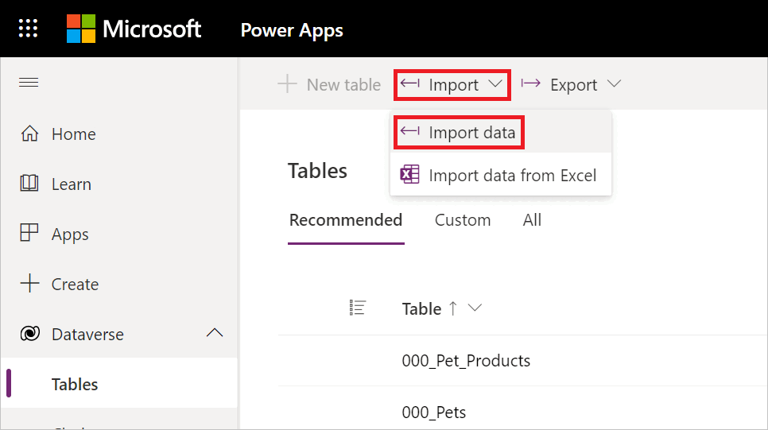](media/where-to-get-data/get-data-power-apps.png#lightbox)

   You can also choose to get data directly from an Excel worksheet without using the **Get data** option.

   [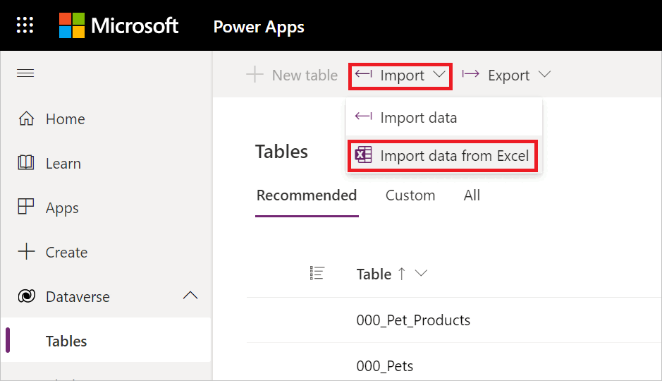](media/where-to-get-data/get-data-excel-powerapps.png#lightbox)

3. Select the connector from the list of data sources.

To import data to an existing table in Power Apps:

1. On the left side of Power Apps, select **Dataverse** > **Tables**.

2. In the **Tables** pane, either:
   1. Select a table in the **Tables** pane that you want to import data to, and then select **Data** > **Get data**.

      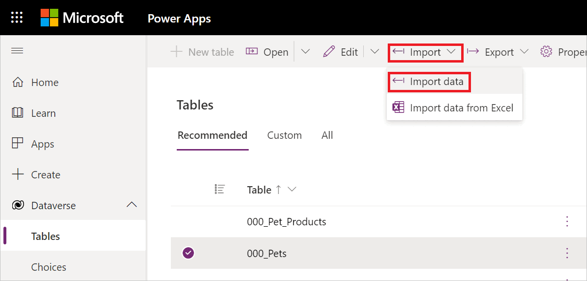

   1. Open the table to its individual pane, and then select **Data** > **Get data**.

      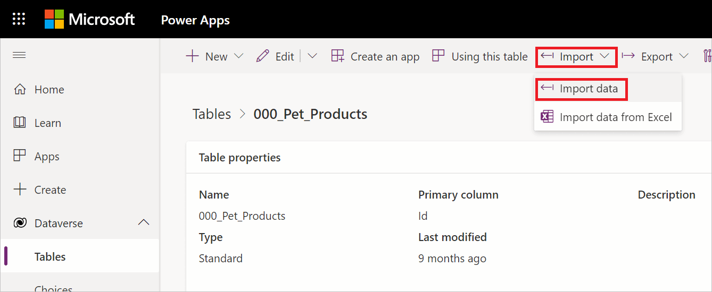

   In either case, you can also choose to get data from an Excel worksheet without using the **Get data** option.

   [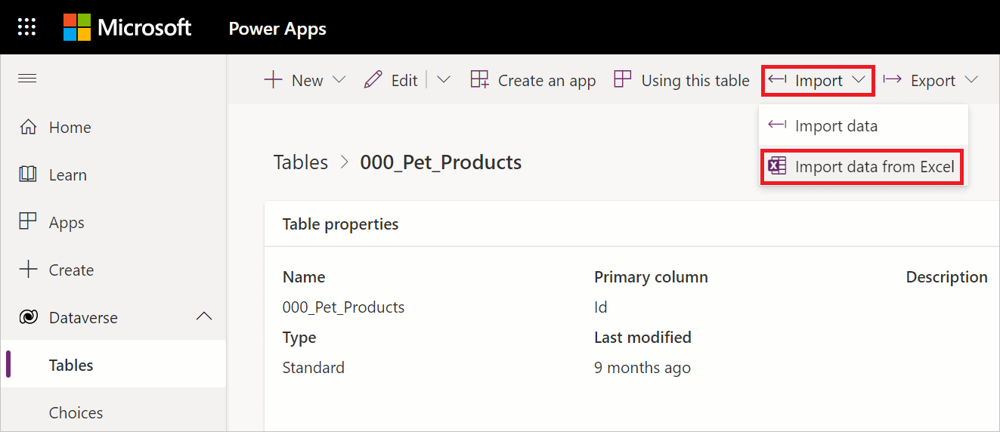

3. Select the connector from the list of data sources.

To get data in Power Apps when creating a dataflow:

1. On the left side of Power Apps, select **Dataverse** > **Dataflows**.

2. If a dataflow already exists:

   1. Double-click on the dataflow.
   1. From the Power Query editor, select **Get data**.
   1. Select the connector from the list of data sources.

3. If no dataflow exists and you want to create a new dataflow:

   1. Select **New dataflow**.
   1. In the **New dataflow** dialog box, enter a name for your new dataflow.

      [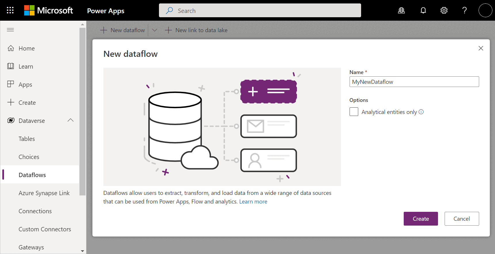](media/where-to-get-data/new-dataflow-powerapps.png#lightbox)

   1. Select **Create**.
   1. Select the connector from the list of data sources.

You'll then be asked to fill out information that's required for you to access the data. Go to the [individual connector articles](connectors/index.md) for more information about this required information.

## Get data from Dynamics 365 Customer Insights

To get data in Customer Insights:

1. On the left side of Customer Insights, select **Data** > **Data sources**.

   [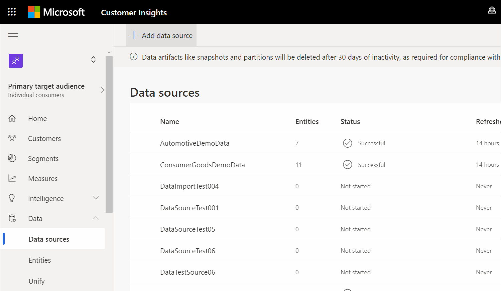](media/where-to-get-data/add-data-source-ci.png#lightbox)

2. In the **Data sources** pane, select **Add data source**.

3. In **Choose your import method**, choose **Microsoft Power Query**.

4. In **Save data source as**, enter a name for your data source.

   [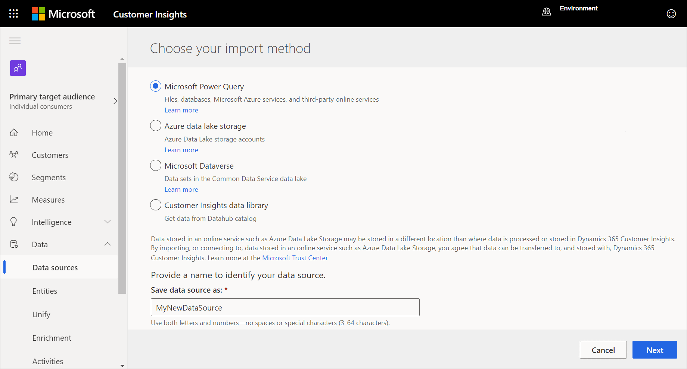](media/where-to-get-data/choose-import-method.png#lightbox)

5. Select **Next**.

6. Select the connector from the list of data sources.

You'll then be asked to fill out information that's required for you to access the data. Go to the [individual connector articles](connectors/index.md) for more information about this required information.

## Get data from Analysis Services

With Analysis Services, a solution is developed in Visual Studio with the Analysis Services projects extension. The solution is then deployed to SQL Server Analysis Services, Azure Analysis Services, or a Power BI Premium workspace.

The Analysis Services documentation contains the following information that describes the process for getting data:

* To set up a Visual Studio solution with the Analysis Services projects extension: [Create a tabular model project](/analysis-services/tutorial-tabular-1400/as-lesson-1-create-a-new-tabular-model-project)

* To get data: [Get data](/analysis-services/tutorial-tabular-1400/as-lesson-2-get-data)
