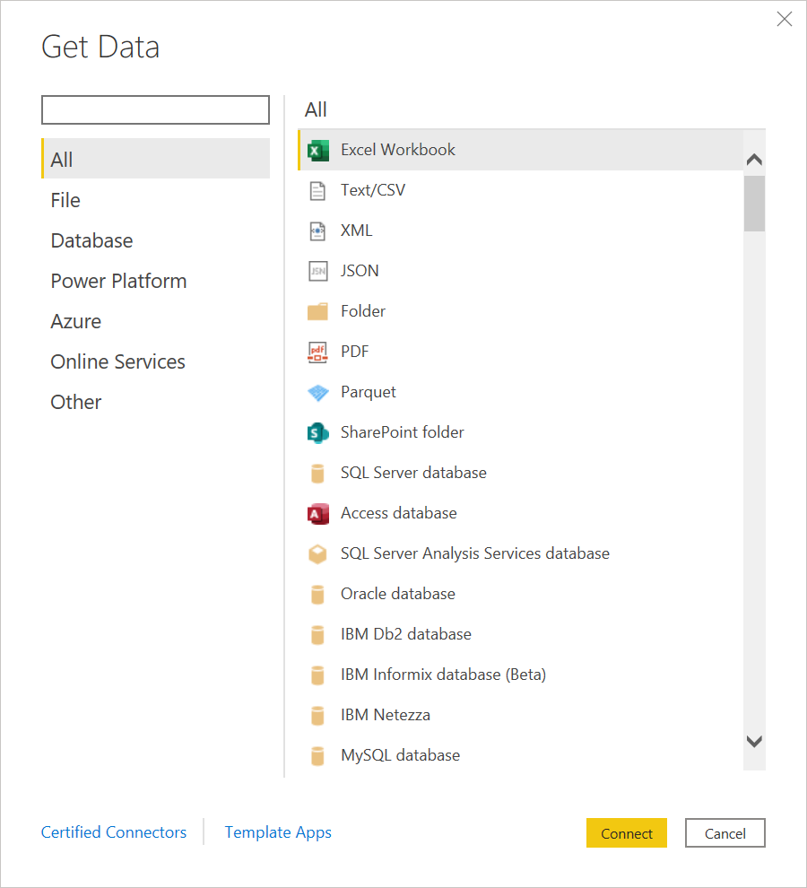

# Where to get data

Getting data from available data sources is usually the first encounter you have with Power Query. This article will show you the basics of getting data from the services that include this feature.

## Get data in Power BI Desktop

To get data in Power BI Desktop:

1. From the **Home** ribbon, select **Get data**.

   

2. From the left side of the **Get Data** dialog box, you can either select one of the categories or enter the name of a connector in the search box.

3. Select the connector you want to use to access your data.
 
4. Select **Connect**. You'll then be asked to fill out information that's required for you to access the data. See the [individual connector articles](connectors/index.md) for more information about this required information.

In Power BI Desktop, you can also select an Excel worksheet, a Power BI dataset, a SQL server database, or Dataverse data without using the **Get data** feature. You can also enter data directly in a table, or select from a data source that was recently used.

## Get data in Excel

To get data in Excel:

1. From the **Data** ribbon, select **Get Data**.

2. Scroll through the category selections in the drop-down box, and select the connector you want to use.

   

You'll then be asked to fill out information that's required for you to access the data. See the [individual connector articles](connectors/index.md) for more information about this required information.

In Excel, you can also select Text/CVS, Web, and Excel worksheet data without using the **Get Data** feature. You can also select from a data source that was recently used and from existing connections or tables.

## Get data from Power BI service

To get data in Power BI service:

1. On the left side of Power BI service, select **Workspaces** (but not **My Workspace**)

2. From the Workspace drop down, select the workspace you want to use.

3. From the workspace (in this example, TestWorkspace01), select the drop-down menu next to **+New**.

4. From the **New** drop-down menu, select **Dataflow**.

5. From **Define new tables**, select **Add new tables**.

6. Select the connector from the list of data sources.

You'll then be asked to fill out information that's required for you to access the data. See the [individual connector articles](connectors/index.md) for more information about this required information.

## Get data from Power Apps

To get data in Power Apps:

1. On the left side of Power Apps, select **Data** > **Tables**.

2. In the **Tables** pane, at the top left, select **Data** > **Get data** > **Get data**.

   

   You can also choose to get data from an Excel worksheet without using the **Get data** feature.

3. Select the connector from the list of data sources.

An alternative method to get data in Power Apps:

1. On the left side of Power Apps, select **Data** > **Dataflows**.

2. If a dataflow already exists:

   1. Double-click on the dataflow.
   1. From the Power Query editor, select **Get data**.
   1. Select the connector from the list of data sources.

3. If no dataflow exists and you want to create a new dataflow:

   1. Select **New dataflow**.
   1. In the **New dataflow** dialog box, enter a name for your new dataflow.
   1. Select **Create**.
   1. Select the connector from the list of data sources.

You'll then be asked to fill out information that's required for you to access the data. See the [individual connector articles](connectors/index.md) for more information about this required information.

## Get data from Dynamics 365 Custom Insights

To get data in Customer Insights:

1. On the left side of Customer Insights, select **Data** > **Data sources**.

2. In the **Data sources** window, select **Add data source**.

3. In **Choose your import method**, choose **Import data**.

4. In **Save data source as**, enter a name for your data source.

5. Select **Next**.

6. Select the connector from the list of data sources.

You'll then be asked to fill out information that's required for you to access the data. See the [individual connector articles](connectors/index.md) for more information about this required information.
