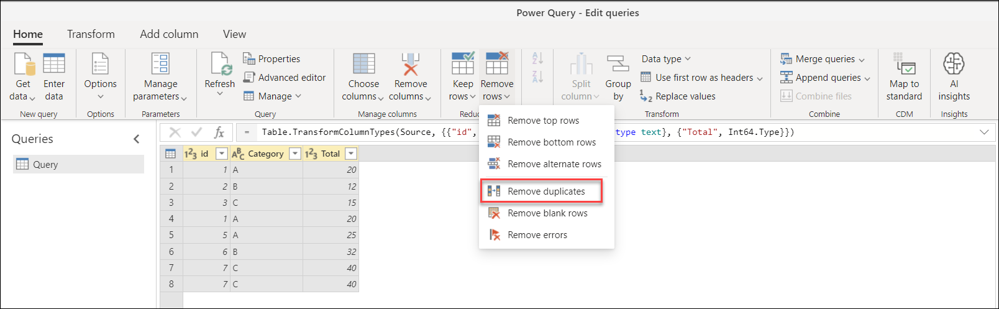
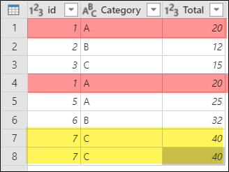
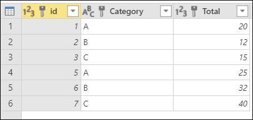
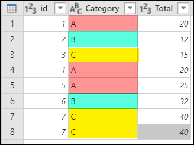
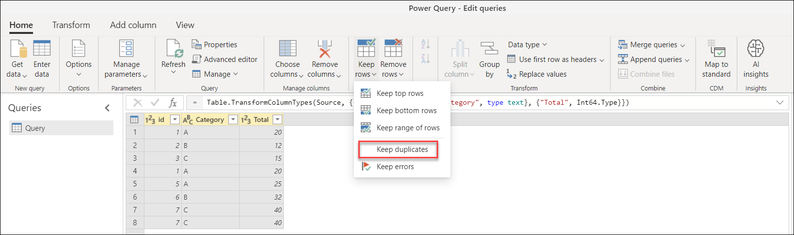
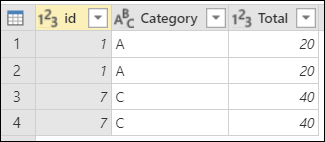
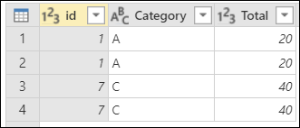

# Working with duplicate values
In Power Query, you can easily work with duplicate sets of values through transformations that can remove duplicates from your data or can easily filter to duplicates only so you can focus on those.

For this article, we will be using the following table with the columns id, Category and Total to demonstrate how to perform the Remove and Keep duplicates operations in Power Query:

## Remove duplicates
One of the operations that you can have Power Query do with duplicates is to remove them from your table.

To remove duplicates:

1. Select the columns used to identify the duplicates.
2. Go to the **Home** tab.
3. In the **Reduce Rows** group, select the **Remove Rows** option.
4. From the dropdown menu for **Remove Rows**, select the option to **Remove duplicates**.

> [!WARNING]
> Power Query doesn't guarantee that it chooses the first instance of a set of duplicates when removing duplicates.

### From multiple columns
From your initial table, in this example you want to identify and remove the duplicates by using all of the columns from your table. 

You can tell that you have four rows that are duplicates. Your goal in this example is to remove those duplicate rows so there are only distinct rows in your table. Select all columns from your table and then select the **Remove duplicates** button. 

The result of that operation will give you the table that you're looking for.

### From a single column
From your initial table, in this example you want to identify and remove the duplicates by using only the **Category** column from your table.

You have multiple duplicates and you want to remove those duplicates to only keep distinct values. To remove duplicates from the Category column, select the **Category** column and then apply the **Remove duplicates** transformation.

The result of that operation will give you the table that you're looking for.

## Keep duplicates
One of the operations that you can have Power Query do with duplicates is to keep only the duplicates found in your table.

To keep duplicates:

1. Select the columns used to identify the duplicates.
2. Go to the **Home** tab.
3. In the **Reduce Rows** group, select the **Keep Rows** option.
4. From the dropdown menu for **Keep Rows**, select the option to **Keep duplicates**.

### From multiple columns
From your initial table, in this example you want to identify and keep the duplicates by using all of the columns from your table. 

You can tell that you have four rows that are duplicates. Your goal in this example is to keep only the rows that are duplicated in your table. Select all the columns from your table and then select the **Keep duplicates** button. 

The result of that operation will give you the table that you're looking for.

### From a single column
From your initial table, in this example you want to identify and keep the duplicates by using only the **id** column from your table.

In this example, you have multiple duplicates and you want to keep only those duplicates from your table. To keep duplicates from the **id** column, select the **id** column and then apply the **Keep duplicates** transformation.

The result of that operation will give you the table that you're looking for.

>[!Note]
> The Data Preview tools in Power Query are a great tool to keep or remove duplicates from a column. You can learn more about how to enable and use the Data Preview tools from the article [Data Preview tools](data-preview-tools.md).
