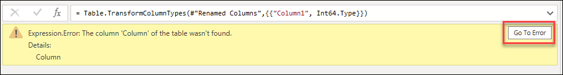
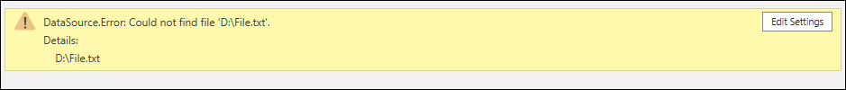
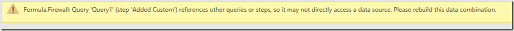
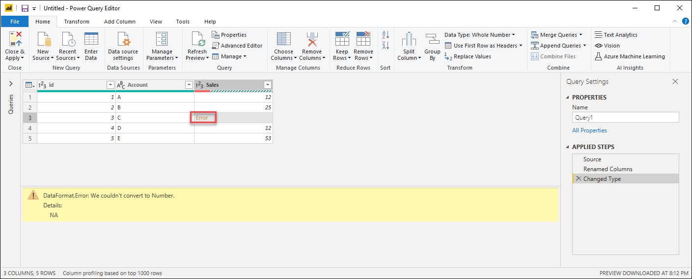
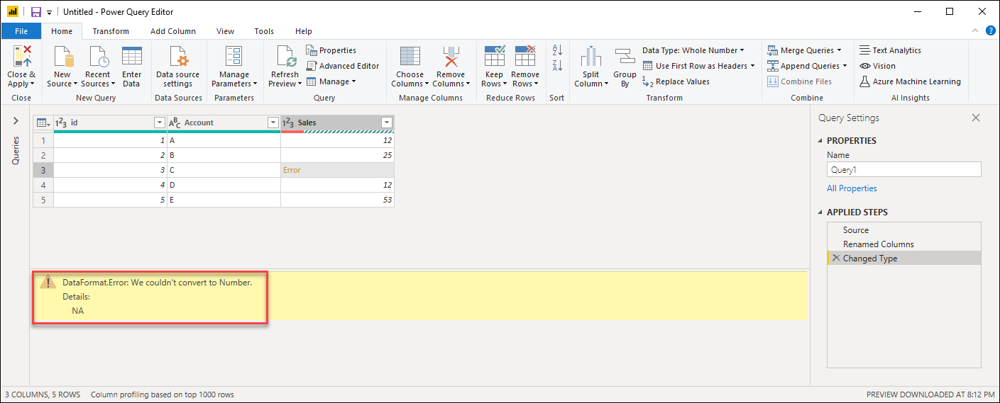
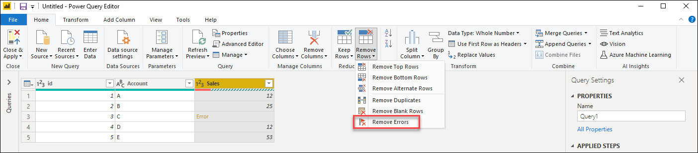
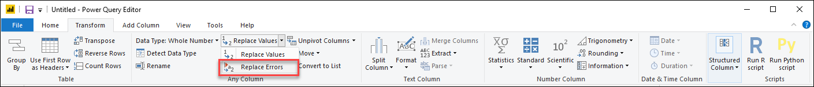
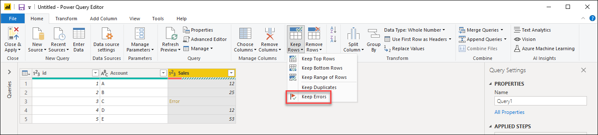
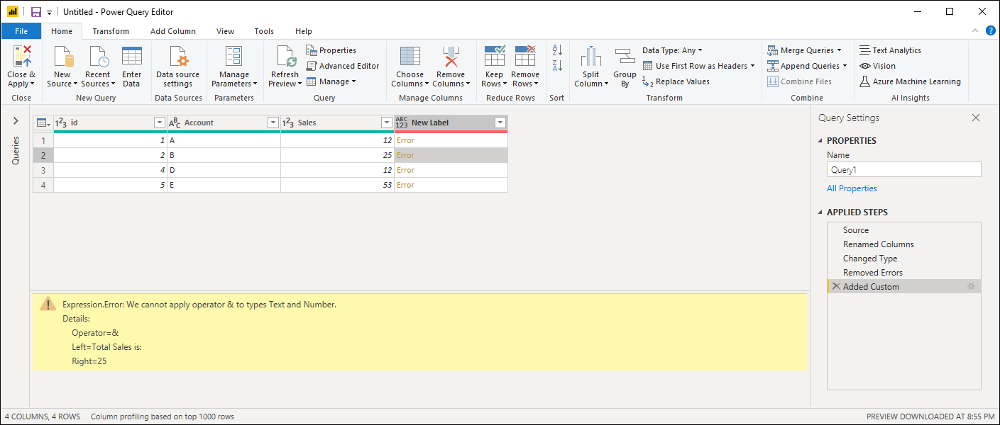
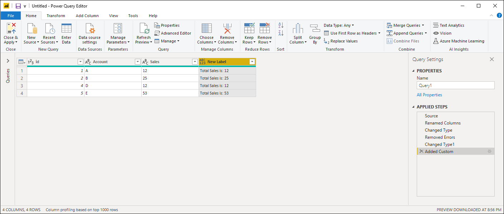

# Working with errors in Power Query

In Power Query, there are 2 place where you could encounter errors:

1. **Step level**
2. **Cell level**

In this article we'll cover both of these and provide suggestions on how to fix the most common errors that you might encounter in them.

Every error has 3 components and these are:

1. **Error reason** 
2. **Error message**
3. **Error detail** 

## Step-level error

A step-level error will prevent the query to load and will provide a yellow ribbon with error components:

1. **Error reason** - the first section before the colon. In the example above is "Expression.Error"
2. **Error message** - The section right after the reason. In the example above is "The column 'Column' of the table wasn't found"
3. **Error detail** - is the section right after the "Details:". In the example above is "Column"

> [!Note] 
> Currently Power Query Online only provides the Error message when step level errors are found.

### Most common step level errors

In all cases, it is recommended that you take a close look at the Error reason, message and detail provided to understand what's causing the error as well as clicking on the "Go to Error" button, if available, to view the first step where the error occurred. 

#### Can’t find the Source - DataSource.Error  

This is commonly a situation where the data source is either inaccessible by the user,  the user does not have the correct credentials to access the data source, or the source has been moved to a different place.

**Example:** We have a query from a Text File that was located in the Drive "D:" and created by user A. User A shares the query to user B who doesn't have access to the drive "D:". When this person tries to execute the query, it gets a DataSource.Error because there is no "D:" drive in their environment.

**Possible solutions:** You can change the file path of the Text file to be one that both users have access to. As User B, you can completely change the file path to be a local copy of the same text file. If available, you can change the file path by clicking on the 'Edit Settings' button.

#### The column of the table wasn't found

Commonly triggered when a step makes a direct reference to a column name that doesn't exist in the query. 

**Example:** We have a query from a Text File where one of the column names was "Column" and in our query we have a step that renames that column to be named "Date", but there was a change in the original Text file and it no longer has a column header with the name "Column" as it was manually changed to "Date". Power Query is unable to find a column header by the name "Column", so it can't rename any columns and it provides the error below:

**Possible solutions:** There are multiple solutions for this case, but they all depend on your end goal and what you'd like to do. For this example, since the correct column header (Date) already comes from our text file, we can just remove this step that renames the column and our query will no longer have issues.

#### Other common step level errors

When combining or merging data between multiple data sources, you might get a Formula.Firewall error as the one shown below:

This could be caused by a number of reasons such as the data privacy levels between data sources or the way that these data sources are being combined / merged. You can read more about the Data Privacy Firewall and how to diagnose this issue from [Data Privacy Firewall](dataprivacyfirewall).

## Cell-level error

A cell-level error will not prevent the query to load, but any error values will be displayed as "Error" inside the Cell. Clicking on the whitespace inside the cell will display the 'Detail pane' underneath the 'Data Preview' where you can see the error components:

### Handling errors at the cell level

When encountering any cell level errors, Power Query provides a set of functions to handle them either by removing, replacing or keeping the errors.

For the next sections, we'll be using the same sample query as the start point. In this query we have a 'Sales' column that has one cell with an error due to a conversion error. The value inside that cell was 'NA', but when we transformed that column to a Whole Number Power Query couldn't convert 'NA' to a number, so it displays that error as shown below:

#### Remove Errors

To remove rows with errors in Power Query, first select the column that contains errors and in the Reduce rows group in the Home tab we have the 'Remove Rows' button. From the dropdown menu, select the option to 'Remove Errors':

The result of that operation will give us the table that we're looking for:

#### Replace Errors

If instead of removing rows with error, we wanted to replace the errors with a fixed value, we can do so as well. To replace rows with errors in Power Query, first select the column that contains errors, in the 'Any column' group in the Transform tab we have the 'Replace Values' button. From the dropdown menu for 'Replace Values', select the option to 'Replace Errors':

This will display the 'Replace Errors' window and in here we enter the value 10 as we want to replace all errors with the value 10:

The result of that operation will give us the table that we're looking for:

#### Keep Errors

Power Query can also serve as a good auditing tool to identify any rows with errors. This is a good example where 'Keep Errors' can be of help. To keep rows with errors in Power Query, first select the column that contains errors, in the 'Reduce Rows' group in the Home tab we have the 'Keep Rows' button.  From the dropdown menu, select the option to 'Keep Errors':

The result of that operation will give us the table that we're looking for:

### Most common cell level errors

As with any Step-level error, it is recommended that you take a close look at the Error reasons, messages and details provided at the cell level errors to understand what's causing the errors. Next we'll see the most frequent cell level errors in Power Query:

#### Data type conversion errors

Commonly triggered when changing the data type of a column in a table. Some values found in the column could not be converted to the desired data type.

**Example:** We have a query that has a Sales column, but one cell in that column has a 'NA' as a cell value, while the rest have whole numbers as values. We decide to convert the data type of the column from text to whole number, but the cell with the 'NA' value yields an error:

**Possible solutions:** After identifying the row with the error, we can either modify the data source to reflect the correct value and not an 'NA' value, or we can apply a 'Replace Error' operation to provide a value to any 'NA' values that yield an error.

#### Operation Errors

When trying to apply an operation that is not supported, such as multiplying a text value by a numeric value, an error will be raised.

**Example:** We want to create a new custom column for our query by creating a text string that contains the phrase "Total Sales: " concatenated to the value from the Sales column. An error will be raised as the concatenation operation only supports text columns and not numeric ones. 

**Possible solutions:** Prior to creating this custom column, we change the data type of the Sales column to be text.

